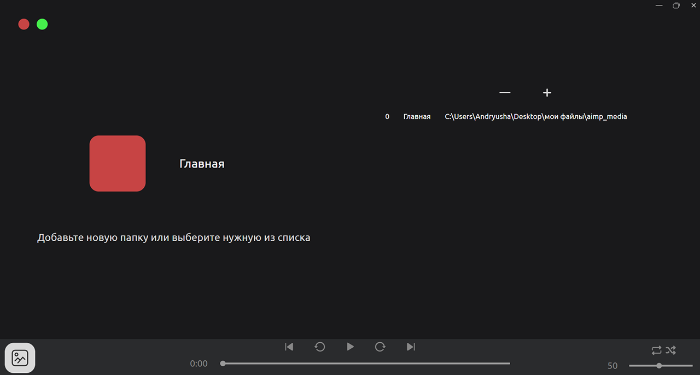

# OPIE Sequoia

---
## Оглавление
1. [Описание](#описание)
2. [Установка](#установка)
3. [Команды](#команды)

<br>

---
## Описание
Sequoia - это приложение для прослушивания музыки офлайн.<br> 

Для работы приложения необходим FFMPEG


С помощью приложения можно прослушивать музыку, объединять ее в плейлисты и менять их метаданные.
Для прослушивания музыки необходимо добавить папку с ней в приложение. Делается это с помощью красной кнопки вверху экрана.


<br><br>

Добавление папки производится по нажатию на кнопку +

<br><br>


---
## Страницы приложения


Основная страница<br><br>

Страница выбора папок<br><br>

Страница создания плейлиста<br><br>

Страница выбранной музыки<br><br>

Эквалайзер<br><br>

Страница редактирования тегов<br>

<br>

---

## Установка
1. Клонируйте репозиторий<br>
   ```git clone https://github.com/opie-official/Sequoia.git```
2. Перейдите в папку<br>
   ```cd Sequoia```
3. Установите все зависимости<br>
   ```npm install```


<br>


---
## Команды

```npm run build``` - компиляция typescript кода<br>
```npm run run``` - компиляция и последующий запуск<br>
```npm run start``` - запуск без компиляции<br>
```npm run pack-amd``` - сборка windows-установщика под архитектуру X64<br>
```npm run pack-arm``` - сборка windows-установщика под архитектуру ARM<br>